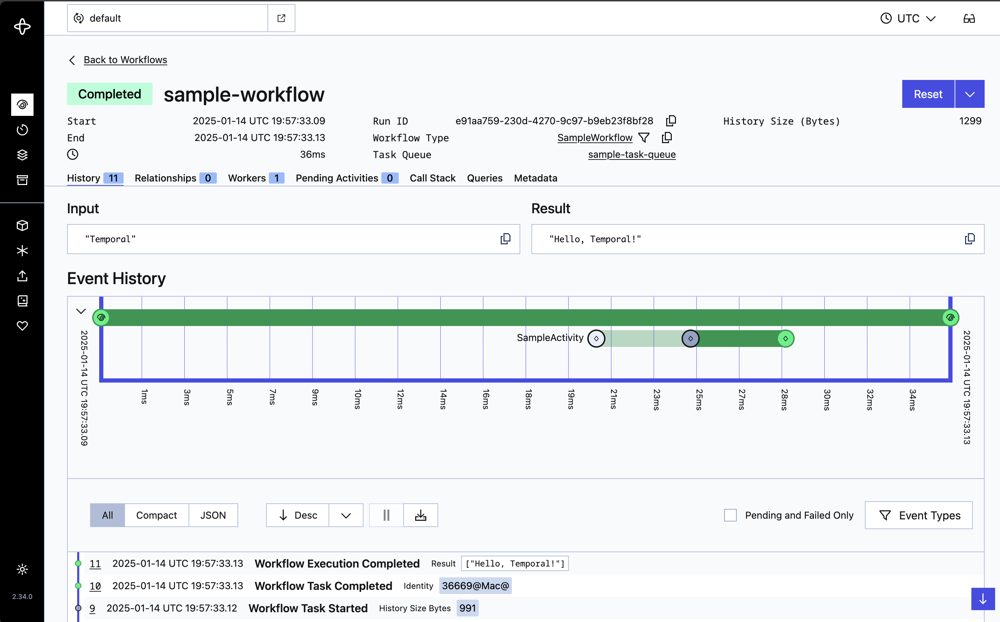

# temporal-demo
 Temporal.io demo project using Golang.

## Objective

Run a local temporal server to be able to run workflows and visualize them through Temporal.io's web UI.

## Installation

Run the docker compose command below to pull and run the needed images. (postgres, temporal server and temporal web UI)

```bash
docker compose up 
```

Next step is to start the worker with the command below.

```bash 
go run src/workers/main.go
```

After the worker has started, run the workflow through the starter.

```bash 
go run src/starter/main.go 
```

You will be able to see the workflow (and its timeline and parameters) that has ran on the Temporal web UI running at localhost:8080, it should be something like below.

